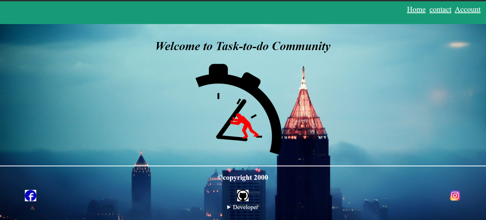
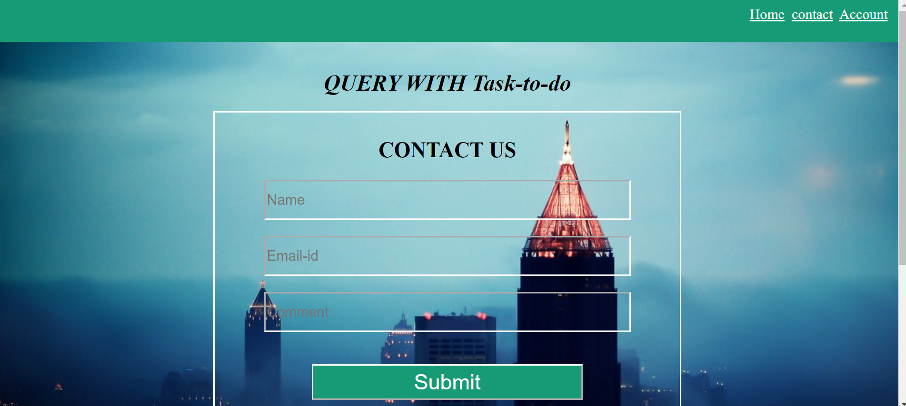
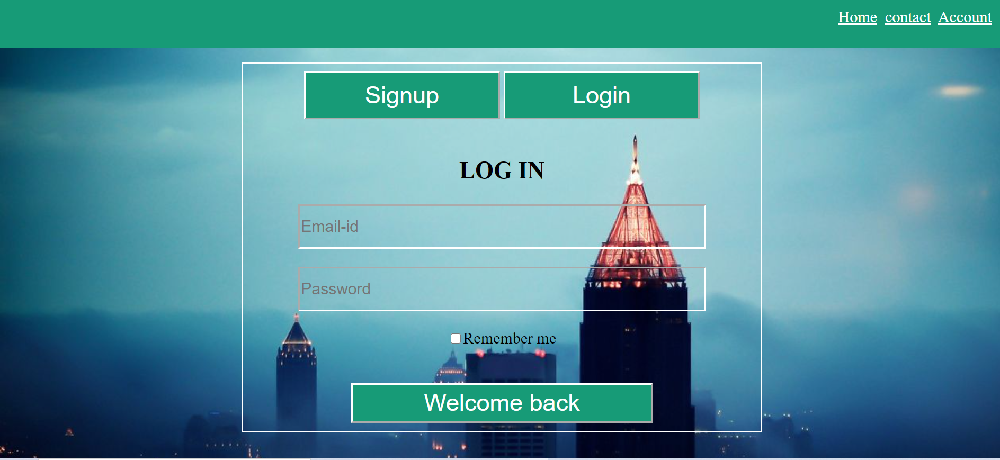
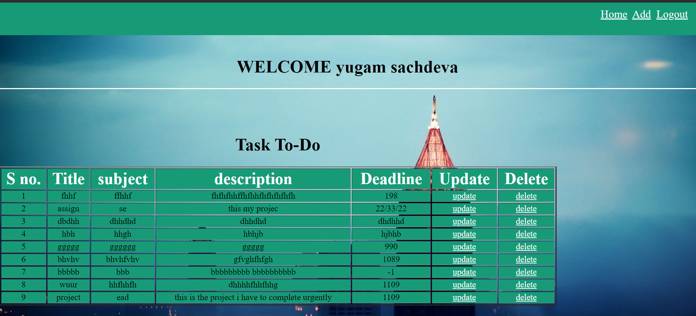

# To-Do
## Description
It's a Task-to-do web application which is use to maintain an individual's time table.This web app has created with flask framework which is based on python language.
## Features
- Query with app
- Account
  - Login
  - signup
  - Remember me
  - Logout
- Home
  - Add task
  - Update deadline
  - Delete task
## Screenshots

